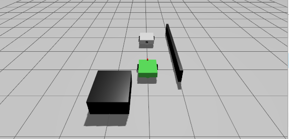

# diffdrive_aruco_follow

ROS 2 Jazzy project for simulating a two-robot differential-drive leader-follower system in Gazebo Sim and RViz2.

The leader robot follows a predefined velocity profile and carries an ArUco marker with ID `42`. The follower robot uses its camera to detect that marker, publishes a debug image, and stores the detected marker poses as a path so it can continue following the leader trajectory.

## Project Overview

This workspace contains two ROS 2 packages:

- `follower_scene`: simulation, robot descriptions, Gazebo world, bridge, RViz configuration, and ros2_control setup.
- `follower_control`: Python control nodes for the leader and follower robots, plus ArUco detection and control helper modules.

The system uses separate namespaces for the two robots:

```text
/leader
/follower
```

The main launch file starts Gazebo Sim, RViz2, the Gazebo-ROS bridge, both robots, both controller managers, the leader controller, the follower controller, and `rqt_image_view` for the processed camera stream.

## Demo

[](https://drive.google.com/file/d/1USltDKkg9fu8IxKernQhQIf-0ha4RkoM/view?usp=sharing)

## Repository Layout

```text
workspace/
└── src/
    ├── follower_scene/
    │   ├── launch/
    │   │   └── bringup.launch.py
    │   ├── config/
    │   │   ├── diff_follower.yaml
    │   │   ├── diff_leader.yaml
    │   │   ├── ros_gz_bridge.yaml
    │   │   └── rviz.rviz
    │   ├── models/
    │   │   └── aruco_3/textures/marker_42.png
    │   ├── urdf/
    │   │   ├── follower_robot.xacro
    │   │   ├── leader_robot.xacro
    │   │   ├── inertial.xacro
    │   │   ├── materials.xacro
    │   │   └── wheel.xacro
    │   └── worlds/
    │       └── map.sdf
    └── follower_control/
        ├── launch/
        │   └── run.launch.py
        └── follower_control/
            ├── follower_control_node.py
            ├── leader_control_node.py
            └── modules/
                ├── aruco_detector.py
                ├── kalman_filter.py
                ├── pd_controller.py
                └── utils.py
```

## Main Features

- Gazebo Sim world loaded from `src/follower_scene/worlds/map.sdf`.
- Two differential-drive robots spawned into the simulation:
  - `follower_bot` at `(0.0, 0.0, 0.0)`.
  - `leader_bot` at `(2.0, 0.0, 0.0)`.
- Robot TF trees are separated using `frame_prefix`:
  - `leader/`
  - `follower/`
- Static transforms connect both odometry frames to `world`.
- `diff_drive_controller` is configured with `use_stamped_vel: true`, so both control nodes publish `geometry_msgs/msg/TwistStamped`.
- The follower detects ArUco marker ID `42` from `/follower/camera/image_raw`.
- A processed debug image is published on `/camera/image_debug`.
- A path-memory target is published as the TF frame `path_memory_target`.

## Dependencies

The project targets ROS 2 Jazzy and Gazebo Sim.

Install the main ROS dependencies:

```bash
sudo apt update
sudo apt install \
  ros-jazzy-ros-gz-sim \
  ros-jazzy-ros-gz-bridge \
  ros-jazzy-ros2-control \
  ros-jazzy-ros2-controllers \
  ros-jazzy-controller-manager \
  ros-jazzy-joint-state-broadcaster \
  ros-jazzy-diff-drive-controller \
  ros-jazzy-robot-state-publisher \
  ros-jazzy-xacro \
  ros-jazzy-rviz2 \
  ros-jazzy-rqt-image-view \
  ros-jazzy-tf2-tools \
  ros-jazzy-nav-msgs \
  ros-jazzy-cv-bridge
```

Install the Python/OpenCV dependencies if they are not already available:

```bash
sudo apt install python3-opencv python3-numpy
```

## Build

From the `workspace/` directory:

```bash
source /opt/ros/jazzy/setup.bash
colcon build
source install/setup.bash
```

If you only changed one package, rebuild that package:

```bash
colcon build --packages-select follower_scene
colcon build --packages-select follower_control
source install/setup.bash
```

Rebuild after changing launch files, config files, URDF/Xacro files, or Python entry points so the installed workspace is up to date.

## Run

Start the complete simulation and control stack:

```bash
cd workspace
source /opt/ros/jazzy/setup.bash
source install/setup.bash
ros2 launch follower_control run.launch.py
```

This launch file:

1. Includes `follower_scene/bringup.launch.py`.
2. Starts Gazebo Sim with the configured world.
3. Starts the Gazebo-ROS bridge.
4. Spawns the follower and leader robots.
5. Spawns `joint_state_broadcaster` and `diff_drive_controller` for both robots.
6. Starts RViz2.
7. Starts `rqt_image_view` on `/camera/image_debug`.
8. Starts `leader_control_node` and `follower_control_node` after an 8 second delay.

Do not launch `follower_scene bringup.launch.py` in another terminal at the same time as `follower_control run.launch.py`. The main control launch already includes the scene launch, and running both can duplicate Gazebo, `/clock`, bridges, or controllers.

## Run Nodes Manually

If the scene is already running, the control nodes can be started manually:

```bash
ros2 run follower_control leader_control_node
ros2 run follower_control follower_control_node
```

For normal use, prefer:

```bash
ros2 launch follower_control run.launch.py
```

## Leader Control

The leader node is implemented in:

```text
src/follower_control/follower_control/leader_control_node.py
```

It publishes `TwistStamped` commands to:

```text
/leader/diff_drive_controller/cmd_vel
```

The current predefined sequence is:

```text
STOP_START              5 s   linear 0.00   angular  0.00
PULL_AWAY               6 s   linear 0.50   angular  0.00
SLOW_LEFT               7 s   linear 0.25   angular  0.18
STRAIGHT_AFTER_LEFT     5 s   linear 0.35   angular  0.00
TURN_RIGHT              6 s   linear 0.30   angular -0.15
STRAIGHT_FINAL          6 s   linear 0.35   angular  0.00
STOP_END                5 s   linear 0.00   angular  0.00
```

The command frame is:

```text
leader/base_link
```

## Follower Control

The follower node is implemented in:

```text
src/follower_control/follower_control/follower_control_node.py
```

It subscribes to:

```text
/follower/camera/image_raw
```

It publishes:

```text
/follower/diff_drive_controller/cmd_vel
/camera/image_debug
```

Important default values in the current code:

```text
marker_id = 42
marker_size = 0.1
desired_distance = 0.3
path_goal_tolerance = 0.15
max_linear_speed = 1.2
max_angular_speed = 2.0
use_path_memory = True
path_spacing = 0.03
path_lookahead = 0.35
history_spacing = 0.05
use_kalman_filter = True
```

When the marker is visible, the follower uses direct ArUco-based control. It also records the detected marker pose in the `world` frame as a path. When marker tracking is not fresh, the follower can continue using the stored path-memory controller.

The path-memory lookahead is currently hard-coded as `0.35` m in `path_memory_control()`.

The detected marker TF frame is:

```text
detected_aruco_42
```

The path-memory target TF frame is:

```text
path_memory_target
```

## ArUco Detection

The detector module is:

```text
src/follower_control/follower_control/modules/aruco_detector.py
```

It uses OpenCV ArUco with:

```text
cv2.aruco.DICT_4X4_250
```

The marker texture used by the leader is:

```text
src/follower_scene/models/aruco_3/textures/marker_42.png
```

The follower estimates a 2D marker pose from OpenCV pose vectors and uses that pose for control and TF publication.

## Topics

Useful topics:

```text
/clock
/follower/camera/image_raw
/follower/scan
/camera/image_debug
/follower/visual_path
/leader/visual_path
/leader/diff_drive_controller/cmd_vel
/follower/diff_drive_controller/cmd_vel
```

The Gazebo bridge is configured in:

```text
src/follower_scene/config/ros_gz_bridge.yaml
```

## ros2_control

Controller configuration files:

```text
src/follower_scene/config/diff_leader.yaml
src/follower_scene/config/diff_follower.yaml
```

Both robots use:

```yaml
use_stamped_vel: true
```

Therefore the control nodes must publish:

```text
geometry_msgs/msg/TwistStamped
```

to:

```text
/leader/diff_drive_controller/cmd_vel
/follower/diff_drive_controller/cmd_vel
```

The controller frame IDs are written without namespaces:

```yaml
base_frame_id: base_link
odom_frame_id: odom
```

Because each controller runs inside `/leader` or `/follower`, the resulting frames become:

```text
leader/odom -> leader/base_link
follower/odom -> follower/base_link
```

## TF Tree

Expected high-level TF structure:

```text
world
├── leader/odom
│   └── leader/base_link
│       ├── leader/wheel_left
│       ├── leader/wheel_right
│       ├── leader/caster_link
│       └── leader/aruco_board_link
└── follower/odom
    └── follower/base_link
        ├── follower/wheel_left
        ├── follower/wheel_right
        ├── follower/caster_link
        ├── follower/camera_link
        └── follower/lidar_link
```

Additional runtime frames:

```text
detected_aruco_42
path_memory_target
```

## Verification

Check that both controllers are active:

```bash
ros2 control list_controllers -c /leader/controller_manager
ros2 control list_controllers -c /follower/controller_manager
```

Expected controllers:

```text
joint_state_broadcaster active
diff_drive_controller active
```

Check camera topics:

```bash
ros2 topic list | grep follower/camera
ros2 topic echo /follower/camera/image_raw --once
```

Check command topics:

```bash
ros2 topic echo /leader/diff_drive_controller/cmd_vel --once
ros2 topic echo /follower/diff_drive_controller/cmd_vel --once
```

Check TF:

```bash
ros2 run tf2_tools view_frames
```

The TF tree should not contain duplicated namespace frames such as:

```text
leader/leader/base_link
follower/follower/base_link
```

View the debug image:

```bash
rqt_image_view /camera/image_debug
```

## Troubleshooting

### RViz reports time jumps

This usually happens when Gazebo or the `/clock` bridge is launched more than once.

Use only:

```bash
ros2 launch follower_control run.launch.py
```

Check the number of `/clock` publishers:

```bash
ros2 topic info /clock
```

### Controllers are not active

Wait a few seconds after launch, then check:

```bash
ros2 control list_controllers -c /leader/controller_manager
ros2 control list_controllers -c /follower/controller_manager
```

If a controller failed to load, rebuild and source the workspace:

```bash
colcon build
source install/setup.bash
```

### The follower does not move

Check these items:

```bash
ros2 topic echo /follower/camera/image_raw --once
ros2 topic echo /camera/image_debug --once
ros2 topic echo /follower/diff_drive_controller/cmd_vel --once
ros2 control list_controllers -c /follower/controller_manager
```

Make sure the ArUco marker is visible to the follower camera in Gazebo/RViz.

### The marker is detected but the follower behaves unexpectedly

Inspect these values in `follower_control_node.py`:

```text
desired_distance
max_linear_speed
max_angular_speed
slow_distance
catchup_distance
path_spacing
history_spacing
```

After changing the Python code, rebuild and source the workspace:

```bash
colcon build --packages-select follower_control
source install/setup.bash
```

## Notes

- The project currently stores most controller constants directly in Python code instead of declaring ROS parameters.
- `follower_scene` is an `ament_cmake` package.
- `follower_control` is an `ament_python` package.
- Generated folders such as `build/`, `install/`, and `log/` are not required for source distribution.
